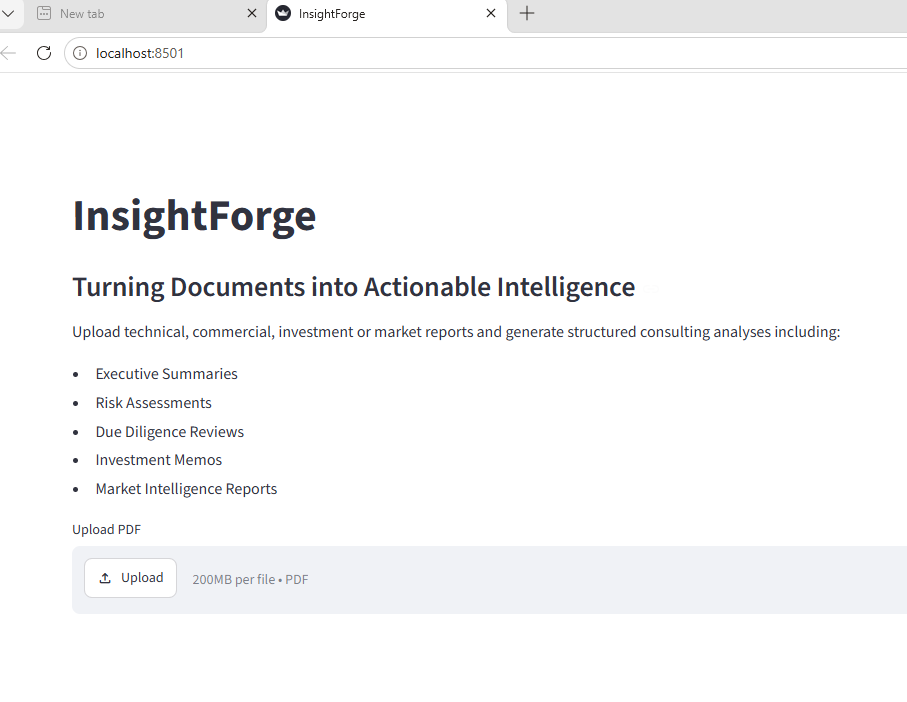
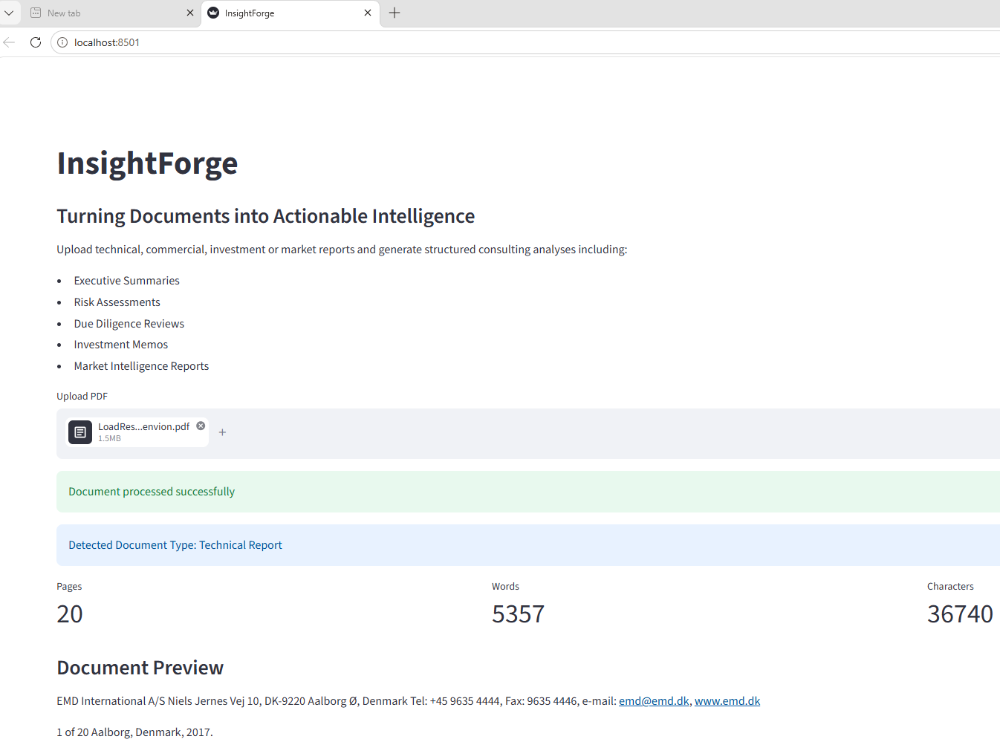

# InsightForge

### Turning Documents into Actionable Intelligence

InsightForge is a document intelligence platform built with Python and Streamlit.

The application helps analysts, consultants, investors and engineers extract insights from technical and commercial reports.

## Features

* PDF document ingestion
* Automated text extraction
* Keyword analysis
* Risk indicator detection
* Opportunity indicator detection
* Consulting prompt generation

## Screenshots

### Home Screen

### Analysis Engine

## Analysis Workflows

* Executive Summary
* Risk Assessment
* Due Diligence Review
* Investment Memo
* Market Intelligence

## Example Use Cases

* Technical Due Diligence
* Commercial Due Diligence
* Renewable Energy Assessments
* Market Intelligence
* Investment Screening

## Technology Stack

* Python
* Streamlit
* PyPDF
* Data Analytics

## Future Roadmap

* LLM Integration
* Retrieval-Augmented Generation (RAG)
* Multi-document Analysis
* Interactive Dashboards
* Portfolio Screening

## Author

Spyros Koutsos
